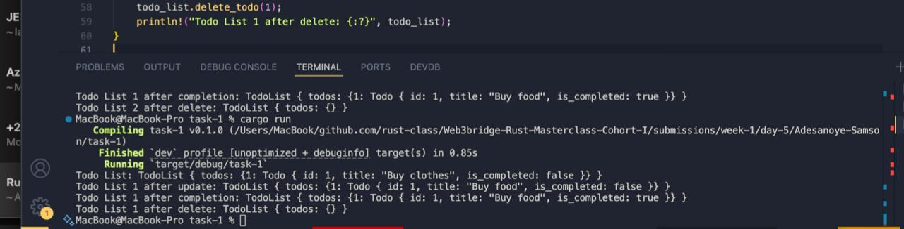

# Task 1: Todo list in Rust

## Objective

Write a Rust program with separate functions to:

- Create Todo
- Update Todo
- Delete Todo
- Edit Todo
- Mark todo as completed
- Then you should attach a screenshot of the printed version, just one image containing the result of the logs of that function.
- Attach the screenshot to the code and Push your code to github also, don't submit screenshot alone.

Then call each of them in `main()` with values and run the program using `cargo run`.

